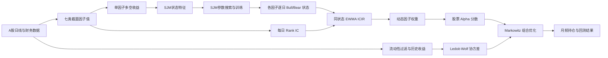

# 状态切换信号的动态因子配置

本项目是一套面向 A 股的量化研究与回测框架。它先用 **Sparse Jump Model（SJM，稀疏跳跃模型）** 识别每个风格因子的 Bull/Bear 状态，再根据当前状态下各因子的历史 Rank IC 稳定性动态分配因子权重，最终通过带约束的 Markowitz 均值-方差优化生成月频股票组合。

项目当前覆盖七类因子：

- `momentum`：动量
- `value`：价值
- `quality`：质量
- `growth`：成长
- `size`：规模
- `lowvol`：低波动
- `liquidity`：流动性

整个仓库包含两条相互衔接的研究流程：

1. **单因子状态识别**：构造因子多空收益、生成状态特征、选择 SJM 参数、识别 Bull/Bear 状态并评估状态驱动的单因子策略。
2. **状态驱动多因子回测**：在月度调仓时根据各因子当前状态下的历史 ICIR 配置因子权重，再对候选股票执行流动性过滤和组合优化。

> 本项目用于量化研究与策略验证，不构成任何投资建议。历史回测结果不代表未来表现。

## 核心思路



### 1. 截面因子

每日从全市场股票数据计算因子分数。代码统一约定为“分数越高越应当做多”，因此规模和低波因子在构造时会调整方向。

| 因子 | 当前实现 |
| --- | --- |
| 动量 | 约 12-1 动量，即跳过最近 21 个交易日后计算过去 252 日收益 |
| 价值 | 最新可用股东权益 / 总市值 |
| 质量 | ROE、经营现金流/总资产、负债率的组合 |
| 成长 | 营业收入同比与净利润同比的组合 |
| 规模 | 总市值对数的相反数，小市值股票得分更高 |
| 低波 | 历史收益波动率的相反数 |
| 流动性 | 成交量 / 流通股本的滚动均值 |

单因子收益采用截面顶部 20% 减底部 20% 的多空组合，并使用上一可用信号交易下一日收益。

### 2. SJM 状态识别

每个因子独立训练一个 SJM。模型基于因子主动收益及其技术、风险和市场环境特征识别低频、持续的市场状态，同时通过稀疏约束选择更有解释力的特征。

模型把状态识别写成带切换成本的时间序列聚类问题。给定特征权重和状态中心时，其核心目标可以概括为：

$$
\min_{s_1,\ldots,s_T}\sum_{t=1}^{T}\sum_{j=1}^{p}w_j(x_{t,j}-\mu_{s_t,j})^2
+\gamma\sum_{t=2}^{T}\mathbf{1}(s_t\neq s_{t-1})
$$

其中 $\gamma$ 越大，状态越稳定、切换越少；特征权重满足 $w_j\geq0$、$\lVert w\rVert_2\leq1$、$\lVert w\rVert_1\leq\kappa$。模型在“状态路径/中心估计”和“稀疏特征权重更新”之间交替迭代。训练期使用可回看的批量动态规划，Validation/Test 则使用只依赖当时及过去信息的前向动态规划，不做反向平滑。

每个因子的 SJM 输入以主动收益 $r^{active}=r^{factor}-r^{market}$ 为核心，主要包含：

- 主动净值的 EWMA、RSI、随机指标 `%K` 和 MACD 柱值
- 主动收益下行波动和相对市场的滚动 Beta
- 沪深 300 的滚动波动率、动量和短长波动率比
- 全市场上涨股票占比及其滚动均值

所有送入模型的 `z_` 特征默认使用扩展窗口标准化，使历史时点的标准化结果不受未来样本影响。

默认状态数为 2。原始状态编号没有固定经济含义，因此项目使用训练期状态内主动收益均值排序：

- 主动收益均值较高的状态命名为 `Bull`
- 主动收益均值较低的状态命名为 `Bear`

默认采用严格的固定时间切分：

| 阶段 | 默认区间 | 用途 |
| --- | --- | --- |
| Training | 2020-01-01 至 2023-06-30 | 拟合模型并确定状态语义 |
| Validation | 2023-07-01 至 2024-06-01 | 选择 SJM 超参数 |
| Test | 2024-06-02 起 | 冻结模型后在线推断与样本外评价 |

SJM 参数选择目标是状态驱动策略的 Sharpe，而不是聚类准确率。默认搜索跳跃惩罚 `gamma`、稀疏约束 `kappa` 和状态数 `K`。代码也保留了滚动验证模式，可按固定周期重新优化。

### 3. 状态条件 ICIR 因子配置

多因子回测默认每月第一个交易日调仓，信号来自严格早于调仓日的上一交易日。

对每个因子，在交易日 $t$ 使用当日因子值与未来 $H$ 个交易日持有期收益计算截面 Spearman Rank IC：

$$
IC_t = \operatorname{Spearman}(f_t, R_{t,t+H})
$$

默认 $H=21$ 个交易日。由于 $IC_t$ 要到 $t+H$ 才完全可知，因此调仓信号日 $T-1$ 只能使用 $T-1-H$ 及以前的 IC，防止未来数据泄漏。

计算某因子的当期 ICIR 时，只保留历史上与当前因子状态相同的 IC。例如当前价值因子是 Bull，则只使用历史价值 Bull 状态的 IC；当前质量因子是 Bear，则只使用历史质量 Bear 状态的 IC。

同状态 IC 使用半衰期 120 个交易日的指数权重计算均值和标准差：

$$
w_i = 0.5^{a_i/120}
$$

$$
ICIR = \frac{\operatorname{EWMA}(IC)}{\operatorname{EWStd}(IC)}
$$

负 ICIR 直接截断为 0，剩余正 ICIR 归一化后得到因子权重：

$$
\omega_k = \frac{\max(ICIR_k, 0)}{\sum_j \max(ICIR_j, 0)}
$$

股票 Alpha 为标准化因子分数的加权和：

$$
\alpha_i = \sum_k \omega_k z(f_{i,k})
$$

### 4. 股票池与组合优化

形成 Alpha 后，组合构建执行以下步骤：

1. 剔除名称中包含 `ST` 的股票。
2. 计算 21 日滚动换手率，动态剔除全市场换手率最低 20% 的股票。
3. 按 Alpha 选择前 `top_n` 只股票，默认 100 只。
4. 使用候选股票过去 252 个交易日收益，通过 Ledoit-Wolf 收缩估计协方差矩阵。
5. 对不同风险厌恶系数 `lambda` 执行 Markowitz 均值-方差优化。

优化目标为：

$$
\max_w \quad \alpha^\top w - \lambda w^\top \Sigma w
$$

约束为：

$$
\sum_i w_i=1, \qquad 0 \leq w_i \leq 5\%
$$

即满仓、只做多、单只股票权重不超过 5%。月内持仓随股票收益自然漂移，下月月初重新平衡。程序比较不同 `lambda` 的累计收益，并保存表现最好的组合。

## 项目结构

```text
.
├── main.py                         # 七因子单因子收益、SJM训练与分析总入口
├── config.py                       # SJM调参、时间切分与滚动验证配置
├── sparse_jump_model.py            # Sparse Jump Model核心实现与在线推断
├── requirements.txt                # Python依赖
├── 沪深300.csv                     # 市场基准数据
├── data/
│   ├── A股日线指标/                 # 按年/月/交易日组织的全市场日线CSV
│   └── A股财务数据/                 # 按报告期组织的财务CSV
├── factor/
│   ├── common.py                   # 日线文件发现、日期解析与价格面板工具
│   └── cross_sectional.py           # 七类截面因子值和单因子多空收益
├── feature/
│   └── sjm_features.py              # SJM特征、市场环境变量与扩展标准化
├── sjm/
│   ├── tuner.py                    # 固定切分/滚动时序参数搜索
│   ├── train_sjm.py                # SJM训练、冻结模型与在线推断
│   └── regime_analysis.py           # 状态统计、模型和图表导出
├── strategy/
│   ├── long_short.py               # 状态到单因子多空仓位的映射
│   └── multifactor_backtest.py      # ICIR动态因子配置与多因子选股回测
├── evaluation/
│   └── metrics.py                  # 策略绩效和状态稳定性指标
├── tests/
│   ├── test_temporal_integrity.py   # 时间完整性、在线推断与状态语义测试
│   └── test_multifactor_backtest.py # ICIR、流动性过滤和优化约束测试
├── models/                          # 每个因子的序列化SJM模型
├── outputs/                         # 中间数据、状态文件和多因子回测结果
└── results/                         # 各因子的分析图表
```

## 环境安装

建议使用 Python 3.11 或更高版本，并在项目根目录创建独立虚拟环境。

### Windows PowerShell

```powershell
python -m venv .venv
.\.venv\Scripts\Activate.ps1
python -m pip install --upgrade pip
pip install -r requirements.txt
```

### macOS / Linux

```bash
python3 -m venv .venv
source .venv/bin/activate
python -m pip install --upgrade pip
pip install -r requirements.txt
```

主要依赖包括：

- `numpy`、`pandas`：数值计算与数据处理
- `scipy`：SLSQP 约束优化
- `scikit-learn`：Ledoit-Wolf 协方差收缩
- `matplotlib`：状态与净值图表

## 数据准备

### A 股日线数据

日线文件按以下方式组织：

```text
data/A股日线指标/
├── 2020年/
│   └── .../2020-01-02.csv
├── 2021年/
└── ...
```

文件名必须包含 `YYYY-MM-DD.csv` 格式的交易日期。程序会递归扫描目录，因此中间的月份目录名称不影响读取。

当前读取器使用的主要中文字段为：

| 字段 | 用途 |
| --- | --- |
| `日期` | 交易日期 |
| `代码` | 股票代码 |
| `名称` | 股票名称及 ST 过滤 |
| `日收盘价` | 收益率、动量和波动率 |
| `日交易量` | 换手率 |
| `流通股本` | 换手率 |
| `总股本` | 可选的股份信息 |
| `总市值(万)` 或 `总市值` | 规模和基本面因子 |

原始文件通常为 GBK 或 GB18030 编码，代码也会尝试 `utf-8-sig` 和 UTF-8。

### A 股财务数据

财务文件放在 `data/A股财务数据/`，文件名通常为报告期，例如 `20240331.csv`。主要字段包括：

- `报告期`、`代码`、`名称`
- `净利润`、`经营现金流`、`营业收入`、`EPS`
- `总资产`、`总负债`、`长期负债`、`股东权益`

由于本地数据只有报告期而没有公告日期，代码默认将财务报表延迟 90 天后视为可用，避免直接在报告期当日使用尚未披露的数据。

### 沪深 300 基准

项目根目录的 `沪深300.csv` 用于构造市场收益、主动收益和多因子净值基准。文件必须包含 `日期`，并至少包含以下两者之一：

- `涨跌幅`：允许带 `%` 的百分比文本，代码会转换为小数收益率
- `收盘`：没有可用涨跌幅时，代码通过收盘价计算日收益

运行前应确保市场数据日期覆盖研究区间。

## 快速开始

完整流程应按以下顺序运行。

### 第一步：生成各因子状态

运行全部七个因子：

```bash
python main.py --factors all
```

只运行一个因子：

```bash
python main.py --factors value
```

运行多个指定因子：

```bash
python main.py --factors momentum,value,quality
```

每个因子会独立完成：

1. 截面因子值和单因子多空收益构建。
2. SJM 特征生成与扩展窗口标准化。
3. 超参数搜索。
4. 独立 SJM 模型训练。
5. Validation/Test 在线状态推断。
6. 状态统计、策略评价、模型和图表导出。

该步骤需要读取全市场日线及财务数据，并对多个参数组合重复训练；全因子运行可能耗时较长。

### 第二步：运行状态驱动多因子回测

多因子回测依赖第一步生成的以下文件：

```text
outputs/<factor>/sjm_state_daily.csv
```

全部状态文件存在后运行：

```bash
python -m strategy.multifactor_backtest
```

指定回测区间和候选股票数量：

```bash
python -m strategy.multifactor_backtest \
  --start-date 2024-06-03 \
  --end-date 2025-12-31 \
  --top-n 100
```

在 Windows PowerShell 中也可以写成单行：

```powershell
python -m strategy.multifactor_backtest --start-date 2024-06-03 --end-date 2025-12-31 --top-n 100
```

### Size、Value、Liquidity 三因子对比实验

该实验保持主多因子回测的 ICIR 权重、股票池过滤、调仓、风险优化和参数搜索不变，仅使用 `size`、`value`、`liquidity` 计算 Alpha。结果以主回测相同格式输出到 `outputs/size_value_liquidity_backtest/`：

```powershell
python -m experiments.size_value_liquidity_backtest
```

实验不会写入主程序的 `outputs/multifactor_backtest/`。为防止重复运行覆盖已有实验结果，如果目标目录已存在且非空，程序会直接退出；此时应通过 `--output-dir` 指定新的目录。

也可指定与主回测相同的区间和候选股票数量参数：

```powershell
python -m experiments.size_value_liquidity_backtest --start-date 2024-06-03 --end-date 2025-12-31 --top-n 100
```

保留已有三因子结果并生成另一组结果：

```powershell
python -m experiments.size_value_liquidity_backtest --output-dir outputs/size_value_liquidity_backtest_v2
```

### Size、Value、Liquidity、Momentum 四因子对比实验

该实验保持主多因子回测的 ICIR 权重、股票池过滤、调仓、风险优化和参数搜索不变，仅使用 `size`、`value`、`liquidity`、`momentum` 计算 Alpha。结果以主回测相同格式输出到 `outputs/size_value_liquidity_momentum_backtest/`：

```powershell
python -m experiments.size_value_liquidity_momentum_backtest
```

如需保留已有结果，可指定新的输出目录：

```powershell
python -m experiments.size_value_liquidity_momentum_backtest --output-dir outputs/size_value_liquidity_momentum_backtest_v2
```

### Size、Value、Liquidity、Momentum、Growth 五因子对比实验

该实验保持主多因子回测的 ICIR 权重、股票池过滤、调仓、风险优化和参数搜索不变，仅使用 `size`、`value`、`liquidity`、`momentum`、`growth` 计算 Alpha。结果以主回测相同格式输出到 `outputs/size_value_liquidity_momentum_growth_backtest/`：

```powershell
python -m experiments.size_value_liquidity_momentum_growth_backtest
```

如需保留已有结果，可指定新的输出目录：

```powershell
python -m experiments.size_value_liquidity_momentum_growth_backtest --output-dir outputs/size_value_liquidity_momentum_growth_backtest_v2
```

### 第三步：运行测试

```bash
python -m unittest discover -s tests -v
```

### Growth 20 日主动收益率对比实验

该实验不使用 SJM，而是按 Growth 因子相对市场的过去 20 个交易日复合主动收益直接划分状态：正收益为 `Bull`，负收益为 `Bear`。结果输出到 `outputs/growth_20d_return_regime/`。

```bash
python -m experiments.growth_20d_regime
```

## 配置说明

### 单因子与 SJM 配置

主要配置位于 `main.py` 的 `PipelineConfig` 和 `config.py` 的 `SJMTuningConfig`：

- `sjm_factor_names`：需要运行的因子集合
- `factor_feature_overrides`：按因子覆盖特征窗口
- `top_ratio`：单因子多空组合两端比例，默认 20%
- `signal_lag_days`：截面因子信号滞后，默认 1 个交易日
- `gamma_list`：SJM 跳跃惩罚参数网格
- `kappa_list`：SJM 稀疏约束参数网格
- `state_number_list`：状态数量，默认只搜索 2
- `tuning_mode`：`fixed_split` 或 `rolling`
- `expected_return_band`：单因子状态预期收益到仓位的线性映射带宽，默认 5%

### 多因子回测配置

主要配置位于 `strategy/multifactor_backtest.py` 的 `MultiFactorBacktestConfig`：

| 参数 | 默认值 | 含义 |
| --- | ---: | --- |
| `lambdas` | 0.3 至 0.8 | Markowitz 风险厌恶系数候选值 |
| `top_n` | 100 | 进入组合优化的最高 Alpha 股票数 |
| `holding_period_days` | 21 | Rank IC 的未来持有期 $H$ |
| `ic_halflife_days` | 120 | 同状态历史 IC 的指数权重半衰期 |
| `turnover_window_days` | 21 | 滚动换手率窗口 |
| `turnover_exclusion_quantile` | 0.20 | 剔除最低换手率股票比例 |
| `covariance_lookback_days` | 252 | 协方差估计历史窗口 |
| `max_stock_weight` | 0.05 | 单只股票最大权重 |
| `start_date` / `end_date` | `None` | 可选回测起止日期 |

如需修改命令行尚未暴露的参数，可在 Python 中显式构造配置：

```python
from strategy.multifactor_backtest import (
    MultiFactorBacktestConfig,
    run_multifactor_backtest,
)

result = run_multifactor_backtest(
    MultiFactorBacktestConfig(
        start_date="2024-06-03",
        end_date="2025-12-31",
        top_n=100,
        holding_period_days=21,
        ic_halflife_days=120,
        max_stock_weight=0.05,
    )
)
print(result["best_lambda"], result["metrics"])
```

## 输出文件

### 因子收益

`outputs/factor_returns/<factor>.csv`

保存该因子的逐日多空收益、两端收益、持仓数量和对应信号日。

### 单因子 SJM 输出

每个因子使用独立目录 `outputs/<factor>/`，常见文件包括：

| 文件 | 内容 |
| --- | --- |
| `sjm_features.csv` | 因子收益、市场收益、主动收益和标准化 SJM 特征 |
| `best_parameter.json` | 验证集选出的最佳 SJM 参数 |
| `parameter_result.csv` | 参数网格及对应评价结果 |
| `sjm_state_daily.csv` | 每日状态编号、Bull/Bear 名称及收益信息 |
| `sjm_feature_weight.csv` | SJM 稀疏特征权重 |
| `sjm_state_centroid.csv` | 各状态特征中心 |
| `sjm_state_transition.csv` | 逐日状态切换记录 |
| `transition_matrix.csv` | 状态转移概率矩阵 |
| `state_statistics.csv` | 状态收益、持续时间等统计信息 |
| `test_strategy.csv` | 固定测试区间状态驱动单因子策略收益 |
| `test_metrics.json` | 测试策略绩效指标 |
| `regime_analysis.txt` | 因子状态分析报告 |
| `analysis_manifest.json` | 本次分析产物路径清单 |

训练后的模型保存到 `models/<Factor>.pkl`，图表保存到 `results/<factor>/` 和对应的 `outputs/<factor>/`。

### 多因子回测输出

默认目录为 `outputs/multifactor_backtest/`：

| 文件 | 内容 |
| --- | --- |
| `rank_ic.csv` | 七个因子的逐日 Rank IC 时间序列 |
| `lambda_results.csv` | 各风险厌恶系数的累计收益、年化收益、Sharpe、最大回撤和平均单边换手率 |
| `monthly_holdings.csv` | 最优 `lambda` 的月度股票持仓、权重、Alpha、因子权重、ICIR 和状态 |
| `daily_returns.csv` | 最优组合每日收益、净值及沪深 300 基准净值 |
| `metrics.json` | 最优 `lambda` 与策略绩效，包括平均单边换手率 `Turnover` |
| `cumulative_return.png` | 多因子策略与沪深 300 累计净值图 |

## 时间完整性设计

该项目显式防范常见的量化回测未来数据泄漏：

- 截面因子收益使用上一日信号交易下一日收益。
- SJM 特征默认采用扩展窗口标准化，不使用全样本均值和标准差。
- 财务数据设置 90 天可用延迟。
- 固定切分中 Training、Validation 和 Test 边界明确。
- Validation/Test 使用冻结模型执行在线推断，不回看未来状态。
- 状态经济含义只由训练期主动收益确定，避免用测试收益重新命名状态。
- 单因子策略执行仓位相对状态信号滞后一个交易日。
- 月频多因子组合使用调仓日前一交易日信号。
- Rank IC 只使用在信号日已完整实现的 $T-H$ 及以前样本。
- 协方差矩阵只使用信号日及以前的历史股票收益。

这些约束由 `tests/test_temporal_integrity.py` 和 `tests/test_multifactor_backtest.py` 持续验证。

## 评价指标

项目输出的主要策略指标包括：

- 累计收益和年化收益
- 年化波动率
- Sharpe Ratio
- 日频 Information Ratio（IR）
- 最大回撤（MDD）
- 平均仓位换手率和平均持有期
- Bull/Bear 状态占比、平均持续时间和状态切换次数

不同输出文件使用的指标集合略有差异：多因子回测当前重点输出年化收益、Sharpe、最大回撤和平均单边换手率；单因子状态分析还会输出更完整的策略及状态统计。多因子换手率按各调仓期的单边换手率取均值，首期建仓记为 100%，后续使用上期持仓随收益漂移后的权重与本期目标权重比较。

## 常见问题

### 为什么部分因子较晚才出现有效结果？

动量和低波因子需要较长历史窗口，SJM 特征本身也包含滚动指标。因此样本初期出现空值并被剔除是正常现象，动量因子的首个有效日期通常明显晚于原始数据起点。

### 为什么运行多因子回测前必须先运行 `main.py`？

多因子回测需要读取每个因子的 `outputs/<factor>/sjm_state_daily.csv`，以确定每个调仓信号日的因子状态。缺少任一配置因子的状态文件都会中止运行。

### 为什么某个月没有生成持仓？

常见原因包括：

- 当前状态下没有足够的历史 IC 样本；
- 所有因子的状态条件 ICIR 均小于等于 0；
- 因子值交集、ST 过滤或流动性过滤后候选股票不足；
- 候选数量与单票权重上限无法同时满足满仓约束；
- 状态日期与交易日无法对齐。

### 为什么全量运行较慢或占用较多内存？

项目需要扫描多年全市场日线文件，并为多个因子构建日度截面矩阵。价值、质量和成长因子还需要将财务数据按可用日期匹配到每只股票。建议先运行单个因子或较短回测区间验证环境，再执行全量流程。

## 开发与扩展

新增因子通常需要完成以下工作：

1. 在 `factor/cross_sectional.py` 中实现因子分数。
2. 将因子加入 `FACTOR_LIST`。
3. 在 `main.py` 的因子注册表和默认配置中注册。
4. 如有必要，在 `feature/sjm_features.py` 中增加专属特征窗口预设。
5. 增加因子方向、时序完整性和回测行为测试。

修改任何涉及信号日期、滚动窗口、训练切分或状态映射的代码时，应优先运行完整测试套件，确保没有引入未来数据泄漏。
